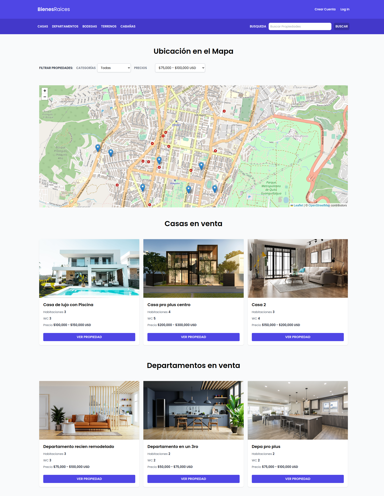
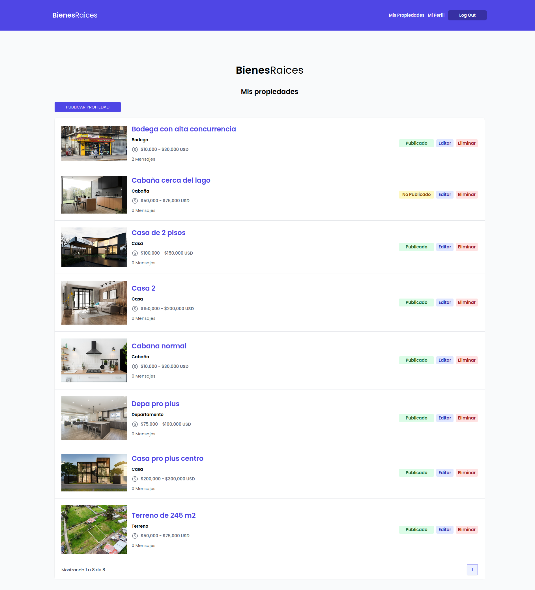
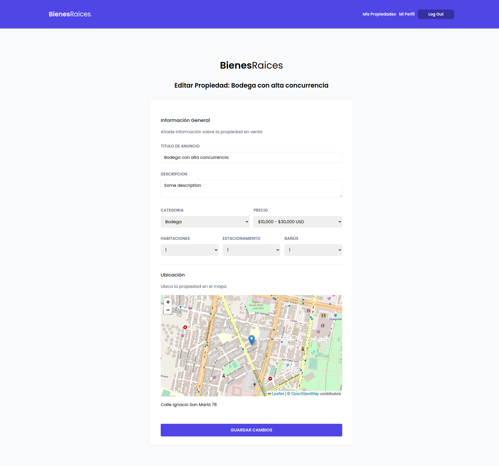
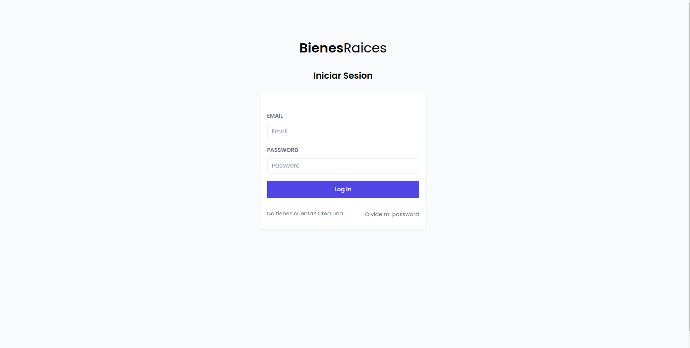
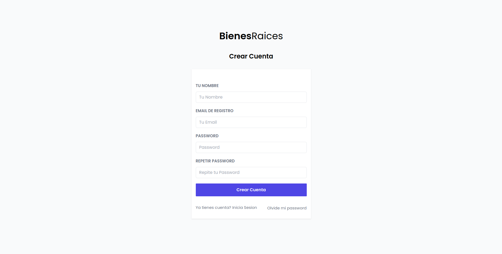

# Real Estate MVC - Node with Pug and Tailwind CSS | Leaflet.js and ESRI geocoder

## Features

⚡️ MVC - Node.js and Express.js\
⚡️ Authorization and Authentication with JWT and cookies\
⚡️ Leaflet with ESRI Geocoder\
⚡️ Styled with Tailwind CSS + Custom SCSS\
⚡️ Responsive\
⚡️ Valid HTML5 & CSS3\
⚡️ MySQL database and Sequelize ORM\
⚡️ Dockerized add

## Running the app

```bash
# install dependencies
pnpm i

# run in dev mode on port 3300
pnpm run dev


# run in production mode on 3300
pnpm start
```

## Running the app with Docker

Running the app with docker

```bash
docker compose up --build
```

Running the app in a development environment with docker on port 3300

```bash
pnpm i

docker compose -f docker-compose-dev.yml up --build
```

## Run SEED

```bash
# delete data
pnpm run db:delete

# populate db
pnpm run db:import
```

## View demo

To see the real-time behavior you can log in with:

-   User 1: `adrian@test.com` and password `123123`.
-   User 2: `alex@test.com` and password `321321`.

[Demo](https://real-state-node-pug-production.up.railway.app/)

## Screenshots






